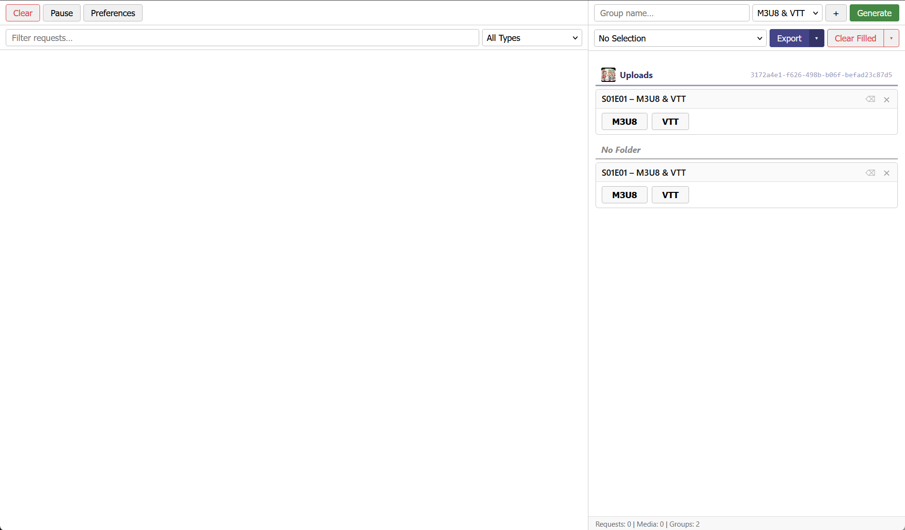
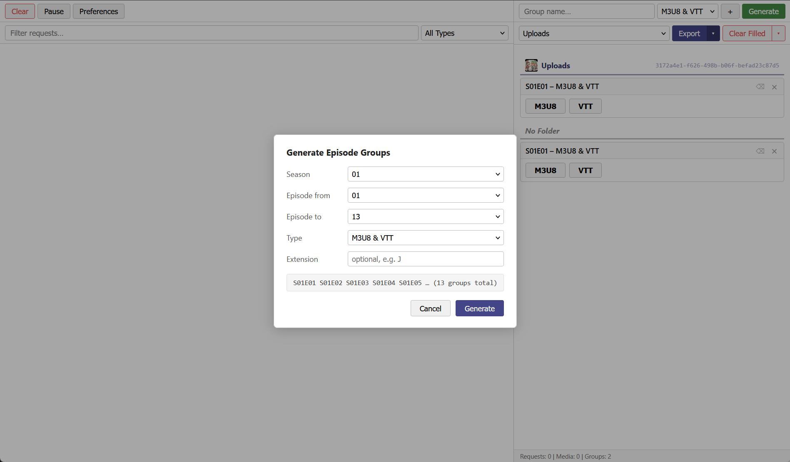
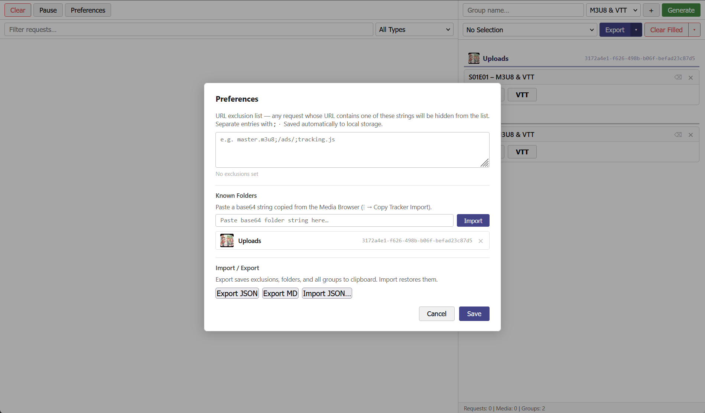
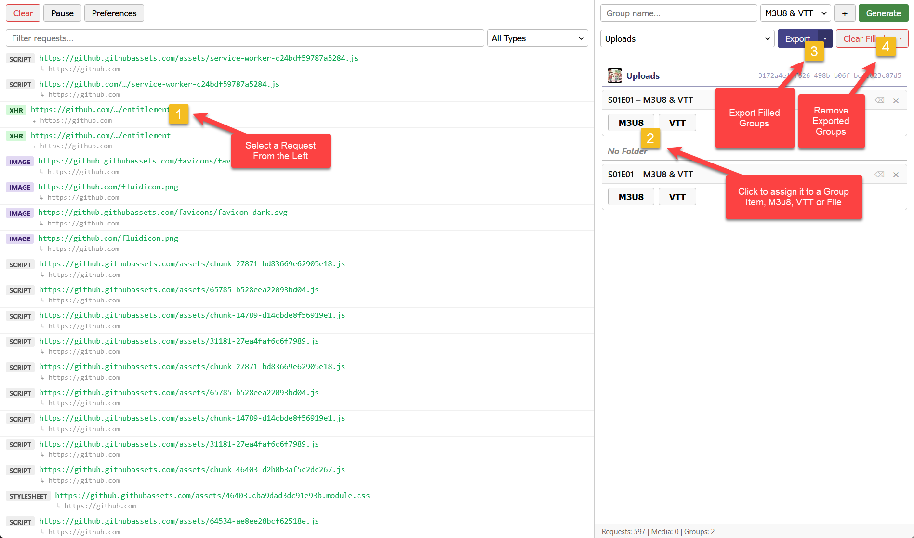
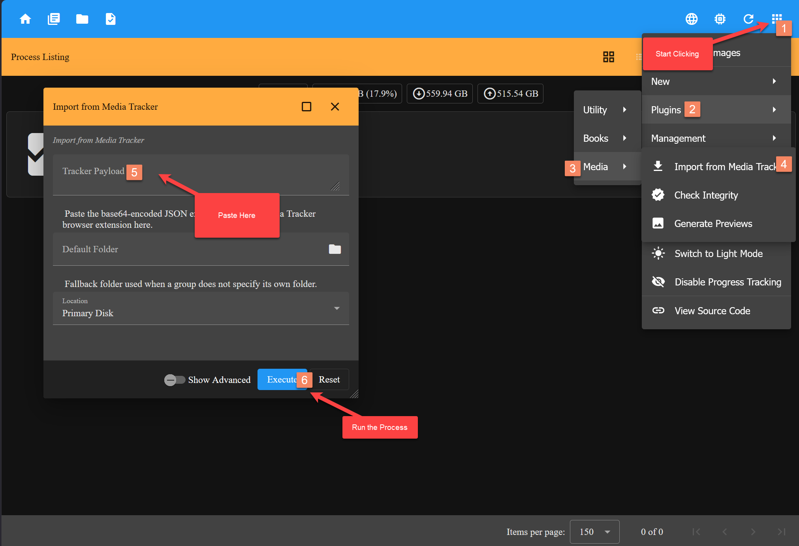

# Media Tracker

A Firefox extension that watches every HTTP request your browser makes while you browse, lets you organise those requests into named groups, and exports the result to your clipboard — ready to paste into another tool.

Built for tracking streaming media (M3U8 playlists, VTT subtitles, video segments) but works with any request type.

---

## Part of the Limited Media Server ecosystem

This extension is a companion tool for the **Limited Media Server** project — a self-hosted, private-network media platform for streaming video, reading manga, browsing music, and downloading content from sources like YouTube and M3U8 streams.

| Project | Description |
|---------|-------------|
| [LimitedMediaServer](https://github.com/mgatelabs/LimitedMediaServer) | Python-based backend server — handles media processing, streaming, downloads, and user permissions |
| [LimitedMediaServerSite](https://github.com/mgatelabs/LimitedMediaServerSite) | Angular web frontend — the browser UI for your media library, connects to the backend server |
| [LimitedMediaTracker](https://github.com/mgatelabs/LimitedMediaTracker) _(this repo)_ | Firefox extension — captures M3U8/VTT URLs while you browse and exports them for the server to process |

### Typical workflow

1. Browse to a streaming site that serves content via M3U8 (HLS)
2. Media Tracker captures the playlist and subtitle URLs in the background
3. Organise the captured URLs into episode groups (e.g. `S01E01`, `S01E02`)
4. Export the groups to your clipboard as base64 JSON
5. Paste into Limited Media Server Site to queue the content for download or processing

---

## What it does

- **Captures requests** in real time as you browse — URLs, status codes, headers, origin info
- **Filters** the list by type: M3U8 + VTT, streams, subtitles, video, audio, XHR, and more
- **Groups** requests by name (e.g. one group per TV episode)
- **Assigns** a request to a group with a single click
- **Exports** groups as compact base64 JSON or Markdown to your clipboard
- **Generates** episode groups in bulk (S01E01 → S01E13 in one click)
- **Organises** groups under folders imported from the companion Media Browser app
- **Excludes** noise (ads, trackers, scripts) via a simple keyword filter

---

## Screenshots

**Main tracker window** — live request capture on the left, group management on the right



**Generate panel** — bulk-create episode groups in one click




**Preferences dialog** — configure exclusions, known folders, and import/export settings



**Quick start walkthrough** — step-by-step flow for new users



**Import server data** — paste base64 folder metadata from the companion app



---

## Installation

This extension is not yet published to AMO. Source code is available at
[github.com/mgatelabs/LimitedMediaTracker](https://github.com/mgatelabs/LimitedMediaTracker).

Load it temporarily in Firefox:

1. Open `about:debugging` in Firefox
2. Click **This Firefox** → **Load Temporary Add-on**
3. Select the `manifest.json` file from this folder

The extension icon will appear in your toolbar. Click it to open the tracker window.

---

## Quick start

1. Click the extension icon — a resizable tracker window opens
2. Browse to a page that streams video
3. The left panel fills with captured requests
4. Use the **M3U8 + VTT** filter to focus on stream and subtitle URLs
5. Create a group on the right (e.g. `S01E01`)
6. Click a request row to select it, then click the group button to assign it
7. Click **Export** to copy the result to your clipboard

---

## UI overview

```
┌─────────────────────────────┬───────────────────────────────┐
│  [Clear] [Pause] [Prefs]    │  [Name] [Type] [+] [Generate] │
│  [Search…] [Filter ▼]       │  [Folder ▼] [Export ▼] [Clear▼]│
├─────────────────────────────┼───────────────────────────────┤
│                             │  ── My Show ──────────────    │
│  STREAM  host/…/master.m3u8 │  ┌─ S01E01  1 items  ⌫  × ─┐ │
│  ↳ https://example.com      │  │  [✅ M3U8 (1)]  [VTT]    │ │
│                             │  └──────────────────────────┘ │
│  SUBTITLE host/…/subs.vtt   │  ┌─ S01E02  ⌫  × ───────────┐ │
│  ↳ https://example.com      │  │  [M3U8]  [VTT]           │ │
│                             │  └──────────────────────────┘ │
├─────────────────────────────┤                               │
│  URL     https://…          │                               │
│  Status  200                │  Requests: 42 | Groups: 2     │
│  Origin  https://…          │                               │
└─────────────────────────────┴───────────────────────────────┘
```

**Left panel** — captured requests, newest first. Click a row to select it and see full details in the pane below. Requests already assigned to a group disappear from this list automatically.

**Right panel** — your groups. Each card shows the group name, item count, a clean (⌫) button to clear items while keeping the group, and a delete (×) button. Groups are sorted alphabetically within their folder.

---

## Groups and folders

Groups can optionally belong to a **folder** — a named container imported from the Media Browser app. Folders appear as section headers in the groups panel, sorted alphabetically. The **Default Folder** dropdown in the toolbar pre-assigns every new group you create to that folder.

To import a folder: open **Preferences → Known Folders** and paste the base64 string copied from the Media Browser.

---

## Preferences

Open with the **Preferences** button in the toolbar.

- **Exclusions** — semicolon-separated keywords; any request URL containing one of them is hidden from the list and ignored by capture (e.g. `master.m3u8;/ads/;tracking.js`)
- **Known Folders** — import folder metadata from the companion app
- **Import / Export** — save and restore your full preferences, folders, and groups as JSON or Markdown

---

## Context menu

Right-click anywhere on a page for two quick actions:

- **Open Media Tracker** — opens the tracker window
- **Clear Captured Requests** — wipes the request log immediately

---

## Technical docs

| Document | Contents |
|----------|----------|
| [export.md](export.md) | Export formats — JSON (base64), Markdown, field reference |
| [import.md](import.md) | Preferences import/export, folder import, snapshot format |
| [storage.md](storage.md) | Where and how data is stored — chrome.storage, localStorage |
| [processing.md](processing.md) | Request capture pipeline, category detection, message API |

---

## Files

| File | Role |
|------|------|
| `manifest.json` | Extension manifest — permissions and entry points |
| `background.js` | Service worker — captures requests, manages groups |
| `popup-launcher.html` / `launcher.js` | Opens the main window when toolbar icon is clicked |
| `window.html` | Full tracker UI |
| `window.js` | All UI logic — rendering, filtering, assigning, exporting |
